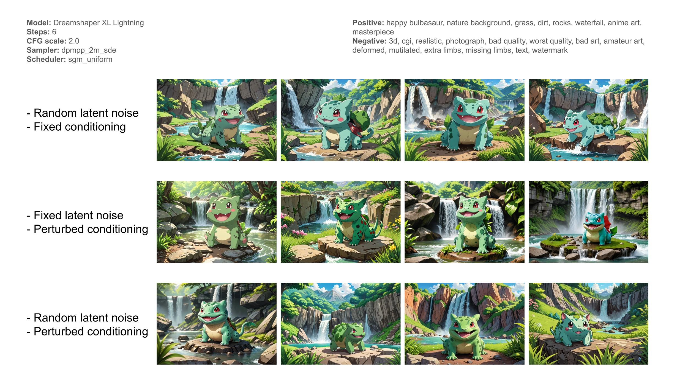
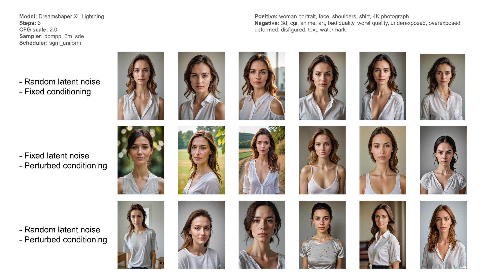

# _topfun's ComfyUI Nodes

Repository of my custom ComfyUI nodes.

## Conditioning Perturbation

Allows for more diverse generation by adding random noise to the text conditioning embeddings.
This node is compatible with SD 1.5 and SDXL 1.0.

### Recommended settings
**Strength (SD 1.5):** <= 0.1  
**Strength (SDXL 1.0):** <= 0.075

### Examples

## Text Generator
A node that allows random text generation controled by a seed from a python script.  

### Usage
The python scripts must be stored in `input/text_generators`.
These scripts must contain a `generate(seed: int)` function, this function must return a sequence of two `str` objects.
